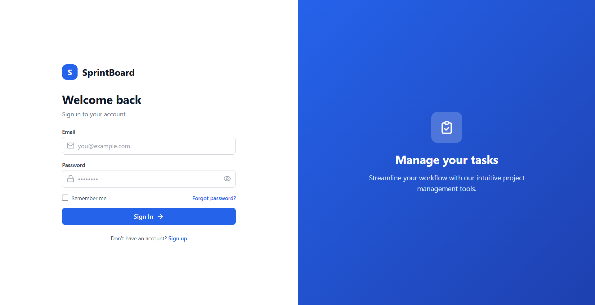
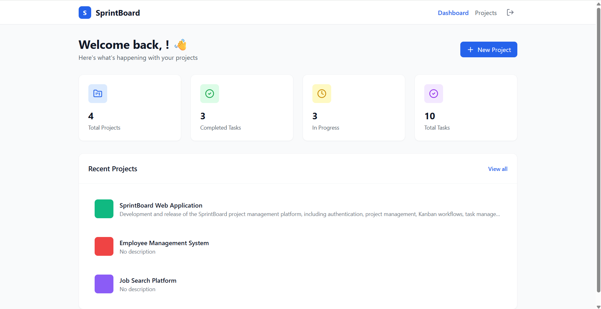
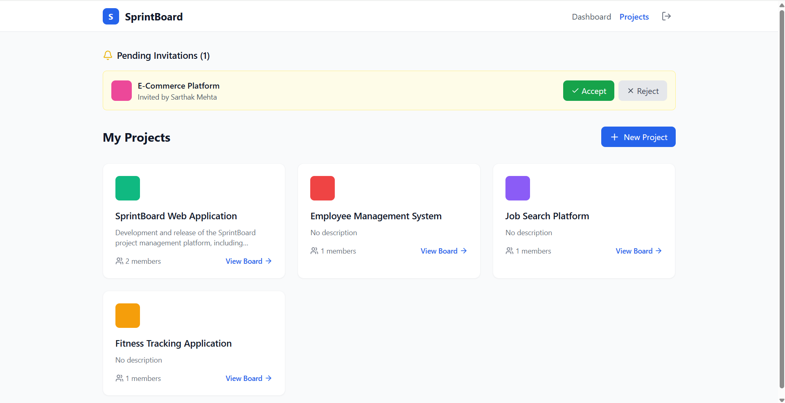
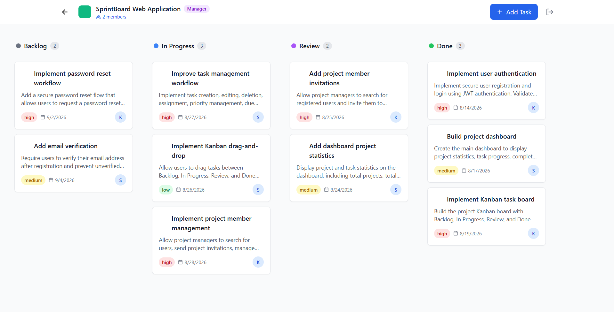
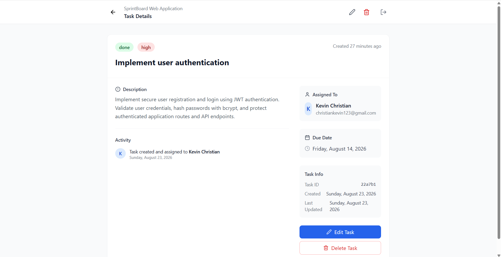
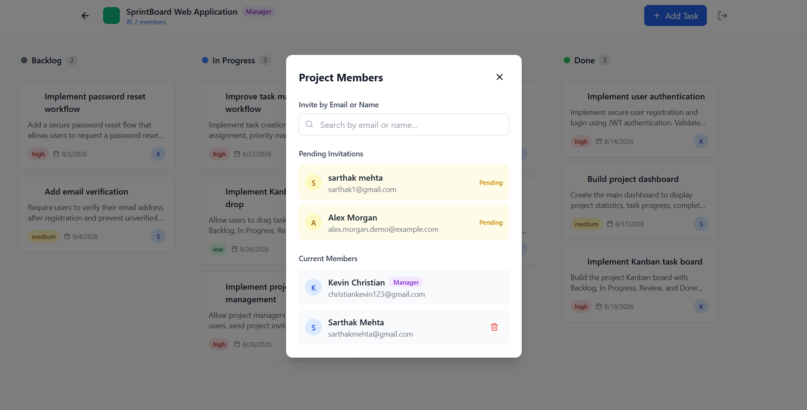

# SprintBoard

**SprintBoard** is a full-stack project management application inspired by Jira-style workflows and Kanban boards. It allows users to create and manage projects, organize tasks through a visual workflow, collaborate with project members, and track work from a centralized dashboard.

> **Mini Jira-style project management application built with React, TypeScript, Node.js, Express, and MongoDB.**

## 🚀 Live Demo

**[Open SprintBoard](https://sprint-board-seven-omega.vercel.app)**

The application is deployed with:

- **Frontend:** Vercel
- **Backend:** Render
- **Database:** MongoDB Atlas

---

## ✨ Features

### 🔐 Authentication

- User registration
- User login
- JWT-based authentication
- Protected application routes
- Protected backend API routes
- Password hashing with bcrypt
- Automatic JWT authorization for API requests
- Logout functionality

### 📁 Project Management

- Create projects
- View projects
- View individual project details
- Update projects
- Delete projects
- Project descriptions
- Custom project colors
- Project creator/manager permissions
- Project member management

### 📋 Task Management

- Create tasks
- View tasks
- View individual task details
- Update tasks
- Delete tasks
- Assign tasks to project members
- Task descriptions
- Task priorities
- Task due dates
- Task tags
- Task ordering
- Drag-and-drop task organization

### 🔄 Kanban Workflow

Tasks can be organized across four workflow stages:

```text
Backlog → In Progress → Review → Done
```

Task status can be updated through the Kanban board using drag and drop.

### 👥 Team Collaboration

- Search for registered users
- Invite users to projects
- View pending project invitations
- Accept project invitations
- Reject project invitations
- View project members
- Remove project members
- Project-manager authorization for member administration

### 📊 Dashboard

The dashboard provides an overview of:

- Total projects
- Total tasks
- Completed tasks
- Tasks currently in progress
- Recent projects

---

## 🖥️ Screenshots

### Login

Users can securely register and sign in to their SprintBoard account.



### Dashboard

The dashboard provides a quick overview of projects and task activity.



### Projects

The projects page allows users to create projects, view existing projects, and manage pending invitations.



### Kanban Board

The project board provides a visual workflow for organizing tasks across different stages.



### Task Details

The task detail page displays information such as the task description, status, priority, assignee, due date, and tags.



### Team Collaboration

Project members and invitations can be managed through the project collaboration features.



---

## 🛠️ Tech Stack

### Frontend

- React 19
- TypeScript
- Vite
- React Router
- Tailwind CSS
- Axios
- dnd-kit
- Lucide React
- React Hot Toast

### Backend

- Node.js
- Express
- MongoDB
- Mongoose
- JSON Web Tokens (JWT)
- bcrypt
- CORS
- dotenv

### Deployment & Development

- Git
- GitHub
- Vercel
- Render
- MongoDB Atlas

---

## 🏗️ Architecture

SprintBoard uses a client-server architecture where the React frontend communicates with a REST API built with Node.js and Express. MongoDB provides persistent data storage through Mongoose.

```text
                         ┌──────────────────────┐
                         │    User / Browser    │
                         └──────────┬───────────┘
                                    │
                                    ▼
                         ┌──────────────────────┐
                         │   React + TypeScript │
                         │        Vite          │
                         │                      │
                         │ React Router         │
                         │ Axios                │
                         │ Tailwind CSS         │
                         │ dnd-kit              │
                         └──────────┬───────────┘
                                    │
                                REST API
                                    │
                                    ▼
                         ┌──────────────────────┐
                         │   Node.js + Express  │
                         │                      │
                         │ Routes               │
                         │ Controllers          │
                         │ JWT Authentication   │
                         │ Authorization        │
                         └──────────┬───────────┘
                                    │
                                Mongoose
                                    │
                                    ▼
                         ┌──────────────────────┐
                         │     MongoDB Atlas    │
                         │                      │
                         │ Users                │
                         │ Projects             │
                         │ Tasks                │
                         │ Invitations          │
                         └──────────────────────┘
```

### Production Deployment

```text
                 Vercel
            React Frontend
                  │
                  │ HTTPS / REST API
                  ▼
                Render
          Node.js + Express API
                  │
                  │ Mongoose
                  ▼
            MongoDB Atlas
               Database
```

---

## 📂 Project Structure

```text
SprintBoard/
│
├── client/
│   ├── public/
│   ├── src/
│   │   ├── context/
│   │   ├── layouts/
│   │   ├── pages/
│   │   ├── routes/
│   │   ├── services/
│   │   ├── types/
│   │   ├── App.tsx
│   │   └── main.tsx
│   │
│   ├── vercel.json
│   ├── package.json
│   ├── vite.config.ts
│   └── tsconfig.json
│
├── server/
│   ├── config/
│   ├── controllers/
│   │   ├── authController.js
│   │   ├── projectController.js
│   │   └── taskController.js
│   ├── middleware/
│   │   └── auth.js
│   ├── models/
│   │   ├── User.js
│   │   ├── Project.js
│   │   └── Task.js
│   ├── routes/
│   │   ├── authRoutes.js
│   │   ├── projectRoutes.js
│   │   └── taskRoutes.js
│   ├── .env.example
│   ├── package.json
│   └── server.js
│
├── .gitignore
├── package.json
└── README.md
```

---

## 🔑 Authentication Flow

SprintBoard uses JSON Web Tokens to authenticate users and protect application resources.

### Registration

1. The user submits their name, email, and password.
2. The backend checks whether the email already exists.
3. The password is hashed using bcrypt.
4. The user is stored in MongoDB.
5. A JWT is generated for the authenticated user.
6. The frontend stores the authentication token.

### Login

1. The user submits their email and password.
2. The backend searches for the corresponding account.
3. bcrypt compares the submitted password with the stored password hash.
4. A JWT is generated after successful authentication.
5. The frontend stores the token.
6. Axios attaches the token to protected API requests.

### Protected Routes

The backend authentication middleware verifies the JWT before allowing access to protected project and task endpoints.

The frontend also uses protected routes to prevent unauthenticated users from accessing application pages.

---

## 🔌 REST API

The backend exposes REST API endpoints for authentication, project management, team collaboration, and task management.

### Authentication

```text
POST /api/auth/register
POST /api/auth/login
```

### Projects

```text
GET    /api/projects
POST   /api/projects
GET    /api/projects/:id
PUT    /api/projects/:id
DELETE /api/projects/:id
```

### Project Collaboration

```text
GET    /api/projects/users/search
POST   /api/projects/:id/invite
POST   /api/projects/:id/accept
POST   /api/projects/:id/reject
DELETE /api/projects/:id/members
```

### Tasks

```text
GET    /api/tasks
POST   /api/tasks
GET    /api/tasks/:id
PUT    /api/tasks/:id
DELETE /api/tasks/:id
PATCH  /api/tasks/:id/status
```

### Health Check

```text
GET /api/health
```

The health-check endpoint is used to verify that the backend service is running.

---

## 🗄️ Data Models

### User

The User model contains:

- Name
- Email
- Password hash
- Role
- Creation and update timestamps

### Project

The Project model contains:

- Project name
- Description
- Project color
- Project creator
- Project members
- Project invitations
- Invitation status
- Invitation timestamp
- Creation and update timestamps

### Task

The Task model contains:

- Title
- Description
- Status
- Priority
- Project
- Assigned user
- Due date
- Display order
- Tags
- Creation and update timestamps

---

## 🚀 Getting Started

### Prerequisites

Before running SprintBoard locally, make sure you have:

- [Node.js](https://nodejs.org/)
- [Git](https://git-scm.com/)
- A MongoDB database, such as MongoDB Atlas

### 1. Clone the Repository

```bash
git clone https://github.com/KevinChristian0409/SprintBoard.git
cd SprintBoard
```

### 2. Install Frontend Dependencies

```bash
cd client
npm install
```

### 3. Install Backend Dependencies

Open a second terminal and run:

```bash
cd server
npm install
```

### 4. Configure the Backend

Create a `.env` file inside the `server` directory:

```text
server/
├── .env
├── .env.example
├── server.js
└── ...
```

Add:

```env
MONGO_URI=your_mongodb_connection_string
JWT_SECRET=your_jwt_secret
CLIENT_URL=http://localhost:5173
```

### Environment Variables

| Variable | Purpose |
|---|---|
| `MONGO_URI` | MongoDB connection string |
| `JWT_SECRET` | Secret used to sign and verify JWT tokens |
| `CLIENT_URL` | Frontend URL allowed by the backend CORS configuration |

The repository includes `server/.env.example` as a template.

> **Never commit your `.env` file, MongoDB credentials, or JWT secret to GitHub.**

### 5. Start the Backend

From the `server` directory:

```bash
node server.js
```

The backend runs locally on:

```text
http://localhost:5000
```

You can verify the API is running by visiting:

```text
http://localhost:5000/api/health
```

Expected response:

```json
{
  "status": "OK"
}
```

### 6. Configure the Frontend

Create a `.env` file inside the `client` directory:

```env
VITE_API_URL=http://localhost:5000
```

The frontend uses `VITE_API_URL` to determine the backend API URL.

### 7. Start the Frontend

From the `client` directory:

```bash
npm run dev
```

The frontend runs locally on:

```text
http://localhost:5173
```

Open the address in your browser to start using SprintBoard.

---

## ☁️ Production Deployment

SprintBoard is deployed as separate frontend and backend services.

### Frontend — Vercel

The React/Vite frontend is deployed on Vercel.

**Live Application:**

https://sprint-board-seven-omega.vercel.app

The production frontend uses:

```env
VITE_API_URL=https://sprintboard-api-4qps.onrender.com
```

The project includes `client/vercel.json` to support client-side React Router routes when users directly visit or refresh routes such as `/login`, `/dashboard`, and `/projects`.

### Backend — Render

The Node.js/Express backend is deployed on Render.

The production backend uses:

```text
MONGO_URI
JWT_SECRET
CLIENT_URL
```

The production `CLIENT_URL` points to the deployed Vercel frontend.

### Database — MongoDB Atlas

MongoDB Atlas provides the persistent database used by the production backend.

---

## 🔒 Security

SprintBoard uses several security practices to protect application data:

- Passwords are hashed with bcrypt before being stored.
- JWTs authenticate protected API requests.
- Backend middleware validates authenticated requests.
- Protected frontend routes prevent unauthenticated access.
- Project access is checked before users can manage project resources.
- Project-manager permissions are enforced for project administration.
- Environment variables are used for sensitive configuration.
- `.env` files are excluded from source control.

---

## 🧪 Development Commands

### Run the Frontend

```bash
cd client
npm run dev
```

### Build the Frontend

```bash
cd client
npm run build
```

### Run Frontend Linting

```bash
cd client
npm run lint
```

### Preview the Frontend Production Build

```bash
cd client
npm run preview
```

### Run the Backend

```bash
cd server
node server.js
```

---

## 📈 Future Improvements

Potential future improvements include:

- Password reset and account recovery
- Email verification
- Automated frontend and API testing
- Improved notification functionality
- Advanced task filtering and sorting
- Project analytics and reporting
- Enhanced error handling
- Production monitoring and logging

---

## 🎯 What This Project Demonstrates

SprintBoard demonstrates practical full-stack development skills, including:

- React and TypeScript development
- REST API development
- Node.js and Express
- MongoDB and Mongoose
- JWT authentication
- Password hashing
- Protected routes
- Authorization and access control
- CRUD operations
- Kanban workflow implementation
- Drag-and-drop interfaces
- Team collaboration features
- API integration with Axios
- Environment-based configuration
- Git and GitHub workflows
- Cloud deployment
- Frontend and backend integration

---

## 📄 License

This project was created for portfolio and educational purposes.